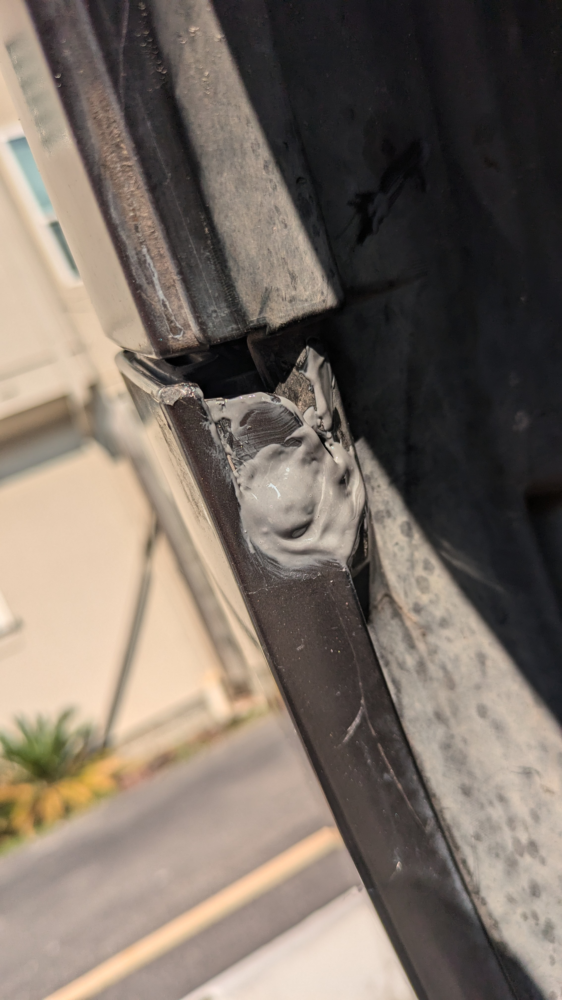
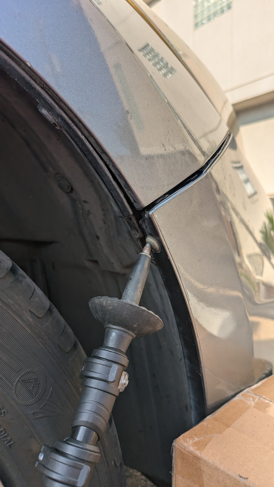
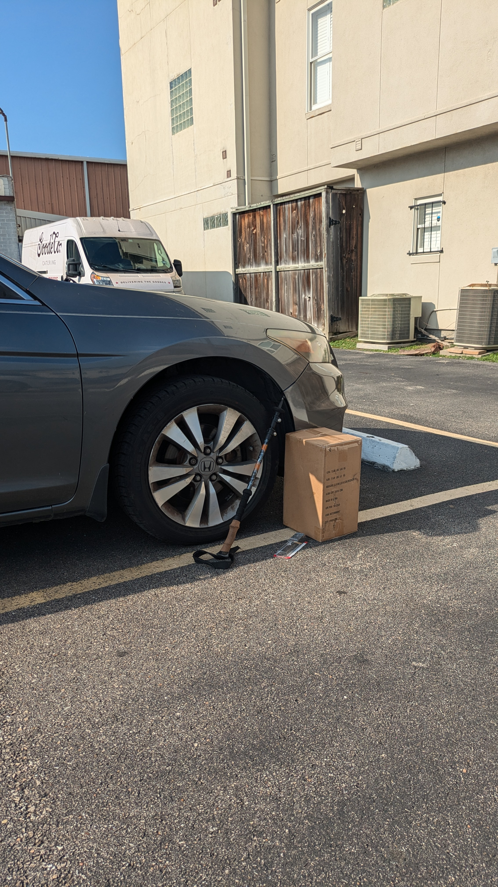
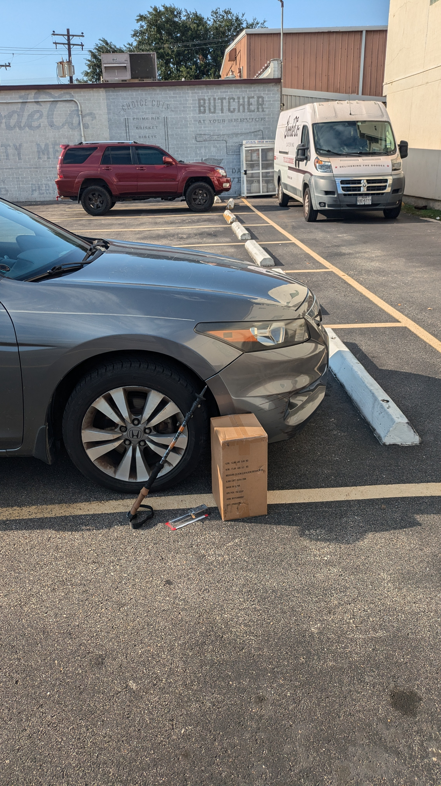

+++
title =  "JB 'Welding' My Bumper"
date = "2024-06-14"
description = "JB Welding a bumper"
author = "Justin Napolitano"
tags = ['automotive']
+++

<!-- # JB Welding a front bumper  -->

So, I snagged my already hanging on by a thread bumper on a piece of rebar. I reversed thinking it was a small bump in the parking lot... I was wrong.

## Why

Bumpers are expensive. I am looking at around $400.00 of bumper + paint if I try to do this on my own. Taking it to the shop... yeah I won't do that.  So, rather than trying to make the prettiest beater in the car lot, I am going to make it at least a functional beater. 

## Tools

I don't really need much of anything for this one, but like always I have a razor blade, a flat head, and a phillips in my overall pockets. 

## Jb Weld

I used [this version of jb weld](https://www.amazon.com/J-B-Weld-50176-KwikWeld-Reinforced/dp/B009EU5ZMA/ref=sr_1_9?crid=E7906IRBRALN&dib=eyJ2IjoiMSJ9.H2AK46mHNlIUo4r-NYZbhYIKI4RetkiJACCrYWumMLNg1qa9S3ng3fxU427OaLfPN4ZODtnZCdNrvbpecLryLyHYMnFiVQbTdSto4IE5ypCvF6CwCm9Hq_E4h1WusqSuxUbdmB11XZ-gupPWJkgVGJpzYRNLmJ4e4mv5WNF3xFbEN9R7p5zP9ZKGvixdCfkxKPSs3MmMIVwEoTRSmKsbatGKPDz5gC_YAgdxIZqr-e8.lSvh4Kpw7vBPORArKFP3njWeNd_JkACbvUe8dsy4JMQ&dib_tag=se&keywords=jb+weld&qid=1718407395&sprefix=jb+weld%2Caps%2C107&sr=8-9) because it was inexpensive and kinda matched the color of my car.  

## Fix the brackets

So on my car there are two brackets underneath the wheel well that broke. On one side the plastic around the screw holding the bumper to the bracket cracked. On the other side the bracket that attaches to the impact bar snapped completely off.  

### Start on the easier side

So the side with the broken attachment point is pretty easy to fix. My goal is not really to make it strong. My goal is only to hold the bumper to the mounting screw until I (if I ever do ) replace the bumper.  Yeah it is kind of annoying, but I'll rip that off and replace the screw when the time comes.  

#### Weld that plastic to the metal

### Move on to the harder side

The right side is a little bit more difficult because the bracket itself snapped off. IF it aligned perfectly with the plastic on the other side, it would be an easy fix... unfortunately it does not. So to fix this one I'll need to rig something up to hold the bumper in place as the resin sets. 

I went with this beatiful set up below.  A trekking pole up against the mounting screw holds the mount against the bit of plastic behind it. The box containing a jack stand holds the bumper just far enough back to make sure that the 'rig' does stays exactly where it needs to stay. 

#### The stick to the screw

#### The box and the bumper

#### The whole thing looking great

